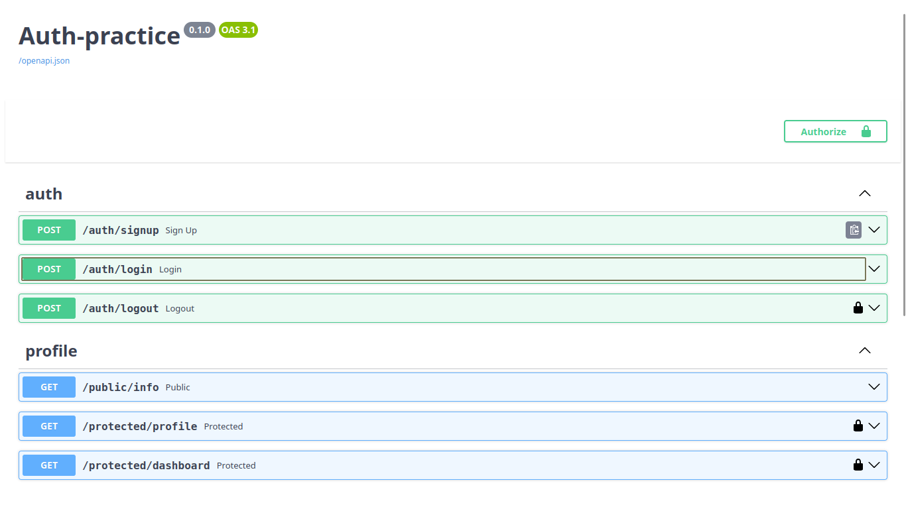

# FastAPI Auth
A lightweight FastAPI backend using Supabase as the authentication provider. It includes signup, login, logout, and token-protected routes, with Supabase issuing and validating JWTs on the server's behalf.

## File structure

```
app/
├── core/
│   ├── exceptions.py       # custom error classes (CustomException and subclasses)
│   ├── config.py           # loads and validates environment variables
│   └── dependencies.py     # auth guards (HTTPBearer, get_current_user)
├── models/                 # Pydantic request/response DTOs
├── routers/                # Exposed endpoints
├── services/               # Implementation of business logic
├── supabase_client.py      # shared Supabase client instance
└── main.py                 # app entrypoint
```

## Environment variables
- Copy .env.example to .env and replace in real values:

|Variable	    | Description    |
|---------------|----------------|
|SUPABASE_URL | Supabase project URL (Settings -> API -> Project URL), no trailing slash|
|SUPABASE_KEY | Supabase anon/public key (Settings -> API -> Project API keys)|
|ADMIN_EMAILS (extra)| Comma seperated admin emails for authorization (admin1@example.com,admin2@example.com)|

## Install & Run it
- Setup a python virtual env and install dependencies:
```bash
python3 -m venv venv
source /venv/bin/activate
pip instal -r requirements.txt
```
- Run the application
```bash
uvicorn app.main:app --reload
```

## API Reference

### Public Endpoints

| Method | Endpoint | Request Body | Success Response | Error Responses |
|--------|----------|--------------|------------------|--------------------|
| POST   | `/auth/signup`  | `{"email": string, "password": string}`     | `201` user object (`id`, `email`, `created_at`, ...) | `400` `{"error": "email and password are required"}` |
| POST   | `/auth/login` | `{"email": string, "password": string}` | `200` `{"access_token": string, "refresh_token": string}` | `400` `{"error": "email and password are required"}`, `401` `{"error": "Invalid login credentials"}` |
| GET | `/public/info` | — | `{"message": "Welcome stranger! This info is public." }` | — |
| POST | `/refresh` |  `{"refresh_token": string}` | `200` `{"access_token": string, "refresh_token": string}` | `400` `{"error": "Access token required"}`, `401` `{"error": "Invalid or expired token"}` |


### Protected Endpoints

> All protected endpoints require `Authorization: Bearer <access_token>`.

| Method | Endpoint | Request Body | Success Response | Error Responses |
|--------|--------- |:-------------:|-----------------|--------------------------------|
| POST   | `/auth/logout` | — | `204` No Content | `401` `{"error": "Access token required"}`, `401` `{"error": "Invalid or expired token"}`           |
| GET    | `/protected/profile`    | —             | `200` `{"id": string, "email": string, "created_at": string}` | `401` `{"error": "Access token required"}` , `401` `{"error": "Invalid or expired token"}` |
| GET    | `/protected/dashboard`  | — | `200` `{"message": "Dashboard info"` | `401` `{"error": "Access token required"}`, `401` `{"error": "Invalid or expired token"}` |

## Swagger-UI
- Interactive docs available at `http://127.0.0.1:8000/docs` after running the application


---

## Extras

#### Inside JWT

A JWT's payload is a base64 encoded JSON, which contains claims like the user's ID, role, and an expiry timestamp, plus a cryptographic signature that lets the server verify the payload hasn not been tampered with. This information is unencrypted, so anyone holding the token can decode the payload instantly (such as using jwt.io), so the purpose of JWT is to provde authenticity.
---

#### Authorization

Admin access is controlled via an `ADMIN_EMAILS` list in `.env` for simplicity. In `dependencies.py`, the `get_admin` builds on the existing token guard (`get_current_user`), then checks if the verified user's email is in `ADMINS` list.

- **401 Unauthorized** = no valid token presented. The server cannot verify the identity of user.
- **403 Forbidden** = a valid token was presented, but that user is not authorized for the request.
---

#### Refresh token
Access tokens are short-lived to limit the damage period if a token is stolen or leaked, and since it is stateless and unrevocable, a shorter duration reduces the misuse of a compromised token.
---

## AI vs me
```
### Prompt
Build a secure backend API in Python that handles user authentication and protects certain routes for authorized users only. Use supabase as the Identity Provider to manage accounts and JWTs.

### Stack: 
- FastAPI
- Supabase Python SDK for auth (`sign_up`, `sign_in_with_password`, `get_user`, `sign_out` )
- dotenv for env variables (`SUPABASE_URL`, `SUPERBASE_KEY` (anon-key))

### Project structure

Separate the code into routers (HTTP only), services (business logic + Supabase calls), models (Pydantic DTOs), and a core module for shared exceptions/handlers and the auth dependency.

### Routes

| Method | Path | Auth | Success |
|--------|------|:----:|---------|
| POST | `/auth/signup` | No | `201` user object |
| POST | `/auth/login` | No | `200` `{access_token, refresh_token}` |
| POST | `/auth/logout` | Yes | `204` |
| GET | `/public/info` | No | `200` `{ "message": "Welcome stranger! This info is public."}` |
| GET | `/protected/profile` | Yes | `200` `{id, email, created_at}` |
| GET | `/protected/dashboard` | Yes | `200` protected payload |

### Validation & errors:
- Check for missing `email`/`password` => `400`
- Bad login credentials => `401 {"error": "Invalid login credentials"}`
- Missing/malformed auth header => `401 {"error": "Access token required"}`
- Invalid/expired token => `401 {"error": "Invalid or expired token"}`
- All errors return `{"error": "<message>"}`.

### Token verification:
- Implement as a reusable FastAPI dependency, with one layer extracting the bearer token, a second verifies it against Supabase's `get_user()` and returns the verified user. Use `Depends()` for routes that require auth.

**Swagger:** configure FastAPI's `HTTPBearer` scheme, to show the Authorize padlock appear on protected routes.

- Project runnable via uvicorn main:app --reload.
```

### Token extraction

- It got the token extraction right. Using FastAPI's HTTPBearer(auto_error=False), which relies on built-in scheme parsing rather than hardcoded string splitting.
- If it does not find a `Bearer` prefix in credentials, it does not crash, but rather the credentials come back as *None*, and the AI's `get_bearer_token()` dependency raises MissingTokenError => clean 401 {"error": "Access token required"}

### Security flaws

- **Handled well:** `get_current_user` does not blindly trust `get_user()`, it catches `AuthApiError` and generic exceptions, and explicitly checks `result.user is None` before returning. No service_role key is loaded anywhere, and no token is ever logged or printed.

- **Flaw 1: Silent logout failure** => `/auth/logout` calls Supabase's Admin API (`auth.admin.sign_out(access_token, "global")`) using a client built from the *anon* key, however the Admin API requires a **service_role** key, so the call fails. The route still returns `204 No Content` as if the session was revoked. In reality the token stays valid until it naturally expires.

- **Flaw 2: Broken dependency** => `auth_service.py` imports `from gotrue.errors import AuthApiError`. The standalone `gotrue` package has been folded into `supabase-py` and renamed to `supabase_auth`, therefore the AI's approach no longer valid in current releases. Since `requirements.txt` pins `supabase>=2.4,<3.0` (open upper bound), a fresh install pulls a version where this import fails immediately.

### What my prompt forgot to specify — and what the AI silently decided

- **Password/email validation**: The AI added `EmailStr` (rejects malformed emails) and `min_length=6` on the password, better validation approach than prompted.
- **Response shape drift**: the prompt specifies `{access_token, refresh_token}` for login. The AI added an undocumented `token_type: "bearer"` field.
- **Unrequested route**: a `GET /` health-check endpoint, not in the spec.
- **Global 422 code to 400**: the AI added a `RequestValidationError` handler so any Pydantic validation failure returns `400 {"error": ...}`, a reasonable inference, but a decision made silently.
- **Dependency pinning**: the prompt didn't ask for a `requirements.txt` with an open upper bound, leaving `supabase<3.0` unpinned on the minor/patch version, which is why the `gotrue` import break on a clean install.